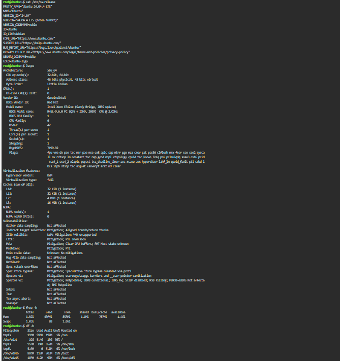

# Laboratory 03 - Multi-Cloud Explorer

## Linux Server Information

### Operating System
- Ubuntu 24.04.4 LTS (Noble Numbat)

### CPU Information
- Architecture: x86_64
- CPU: Intel Xeon E312xx (Sandy Bridge, IBRS update)
- Number of CPU(s): 1
- Virtualization: KVM (Full Virtualization)

### Memory
- Total Memory: 1.9 GiB
- Used Memory: 430 MiB
- Free Memory: 853 MiB
- Available Memory: 1.4 GiB
- Swap: 1.0 GiB

### Disk Space
- Root Partition (/): 19 GB
- Used: 5.4 GB
- Available: 13 GB
- Usage: 30%

## Cloud Hosting Recommendation

If this Linux server were migrated to the cloud, it could be hosted using the following services:

- **AWS:** Amazon EC2
- **Microsoft Azure:** Azure Virtual Machines
- **Google Cloud Platform:** Compute Engine

These cloud services provide virtual machines that can run Linux operating systems while offering scalability, reliability, security, and high availability.

## Screenshot

