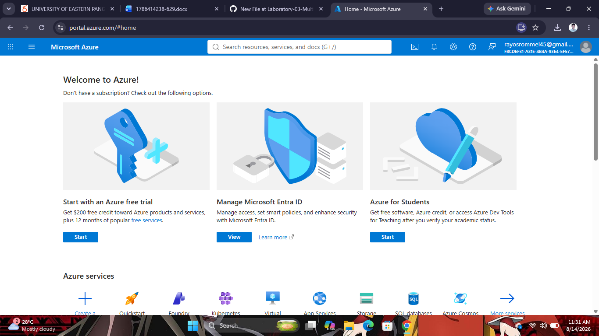

# Microsoft Azure Research

## Brief Overview
Microsoft Azure is a cloud computing platform developed by Microsoft. It was launched in 2010 and offers a wide range of cloud services, including virtual machines, storage, networking, databases, artificial intelligence, and analytics. Azure is widely used by businesses, educational institutions, and government organizations.

## Global Infrastructure
Microsoft Azure operates a global network of regions and availability zones across many countries. This infrastructure helps ensure high availability, disaster recovery, and low-latency access to cloud resources.

## Cloud Management Console
The Azure Portal is a web-based management interface that enables users to create, configure, monitor, and manage Azure resources from a single dashboard.

## Four (4) Core Services
1. **Azure Virtual Machines** – Provides scalable virtual machines for hosting applications.
2. **Azure Blob Storage** – Offers secure and scalable object storage for files and data.
3. **Azure SQL Database** – A fully managed relational database service.
4. **Azure Virtual Network (VNet)** – Enables secure communication between Azure resources.

## Three (3) Advantages
- Excellent integration with Microsoft products such as Windows Server, Active Directory, and Microsoft 365.
- Strong security and compliance features.
- Reliable global infrastructure with high availability.

## Typical Enterprise Use Cases
- Enterprise application hosting
- Hybrid cloud solutions
- Backup and disaster recovery
- Web and mobile application hosting
- Data analytics and business intelligence

## Screenshot

**Source:** https://azure.microsoft.com/
