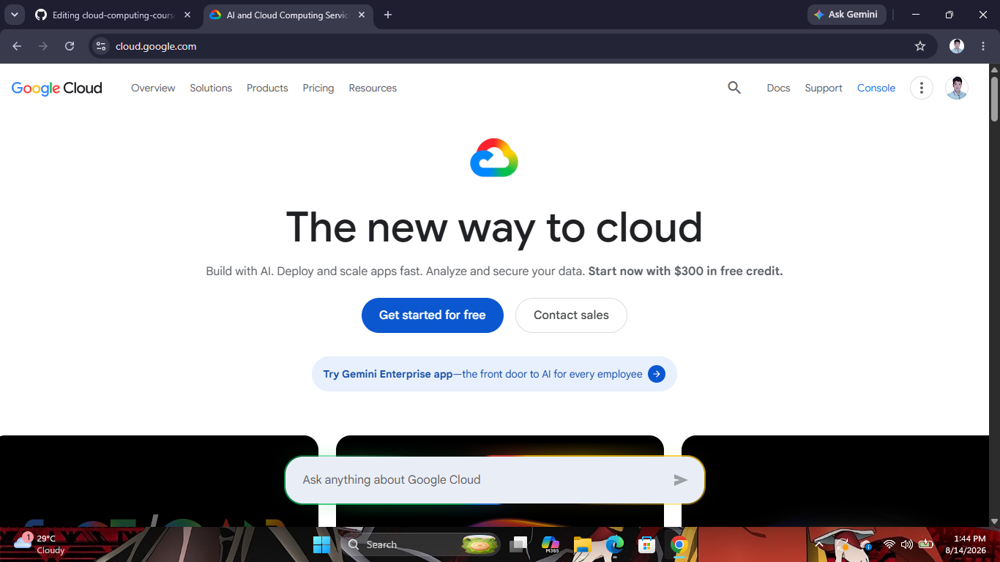

# Google Cloud Platform (GCP) Research

## Brief Overview
Google Cloud Platform (GCP) is a cloud computing platform developed by Google. It was launched in 2008 and provides cloud services such as computing, storage, networking, databases, artificial intelligence, and machine learning. GCP is known for its innovation in AI, data analytics, and Kubernetes.

## Global Infrastructure
Google Cloud Platform operates a global network of regions, zones, and edge locations. Its infrastructure is designed to provide high performance, reliability, and low-latency access for users around the world.

## Cloud Management Console
The Google Cloud Console is a web-based interface that allows users to create, manage, and monitor cloud resources. It provides access to all GCP services through a centralized dashboard.

## Four (4) Core Services
1. **Compute Engine** – Provides scalable virtual machines in the cloud.
2. **Cloud Storage** – Offers secure and durable object storage.
3. **Cloud SQL** – A fully managed relational database service.
4. **Google Kubernetes Engine (GKE)** – A managed Kubernetes service for deploying and managing containerized applications.

## Three (3) Advantages
- Excellent support for Artificial Intelligence and Machine Learning.
- Strong integration with Kubernetes and container technologies.
- High-performance global network infrastructure.

## Typical Enterprise Use Cases
- Artificial Intelligence and Machine Learning
- Big Data Analytics
- Containerized application deployment
- Web and mobile application hosting
- Cloud-native application development

## Screenshot

**Source:** https://cloud.google.com/
